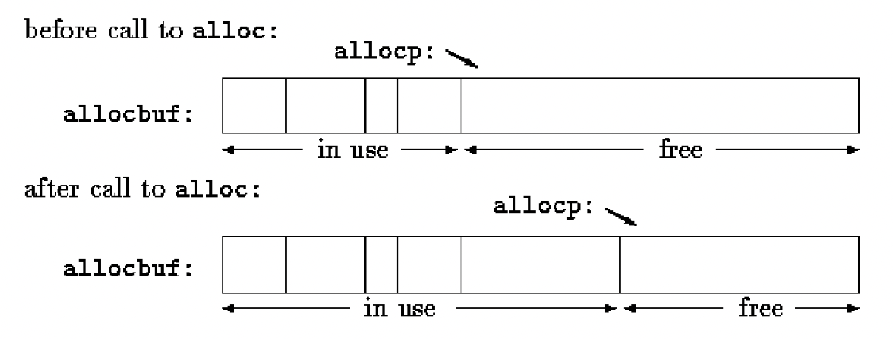
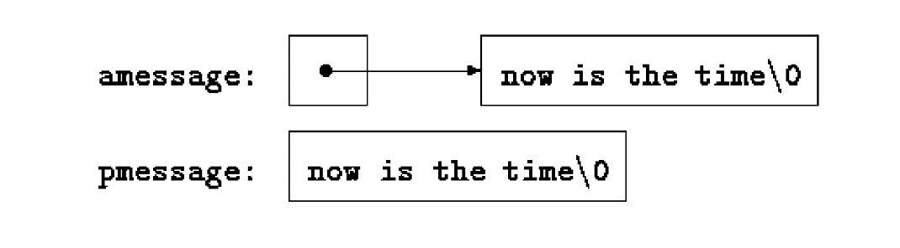
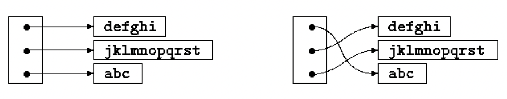
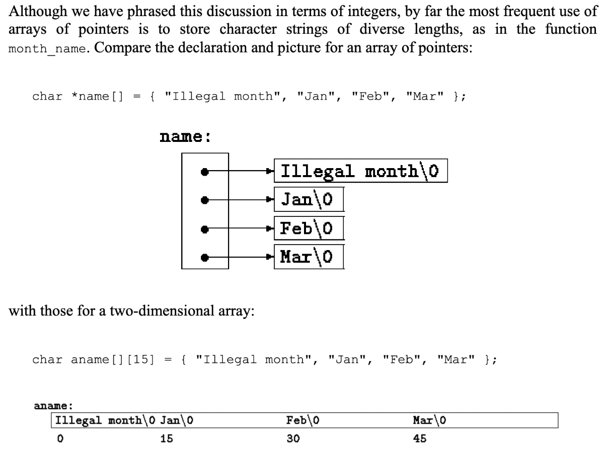

# lesson-8

#### Address Arithmetic
Writing a rudimentary storage allocator with two routines:

1. alloc(n) returns a pointer to n consecutive character positions which can be used by the caller of alloc for storing characters
2. afree(p) releases the storage thus acquired so it can be re-used later. 

The routines are “rudimentary” because the calls to afree must be made in the opposite order to the calls made on alloc. That is, the storage managed by alloc and afree is a stack. The standard library provides analogous functions called malloc and free that have no such restrictions. 

#### Implementation:
1. alloc hands out pieces of a large character array that we will call allocbuf. 
    - This array is private to alloc and afree. Since they deal in pointers, not array indices, no other routine need know the name of the array, which can be 
   - declared static in the source file containing alloc and afree. 
2. We can later implement this with malloc, where the array will not even have a name, and malloc asks the OS for a pointer to some unnamed block of storage.
3. We use a pointer allocp that points to the next free element.
alloc(n) checks if there is room for n left in allocbuf, if so it return the current value of allocp, then increments it by n to point to the next free area. 
    - If there is no room, alloc returns zero (C guarantees that zero is never a valid address for data). 
4. afree(p) merely sets allocp to p if p is inside allocbuf.



#### ALLOC
```c
#include <stdio.h>

// K&R Pg. 101

#define ALLOCSIZE 10000 // size of available space

static char allocbuf[ALLOCSIZE]; // storage for alloc
static char *allocp = allocbuf;  // next free position

char *alloc(int n) // return pointer to n characters
{
    if (allocbuf + ALLOCSIZE - allocp >= n) // it fits
    {
        allocp += n;
        return allocp - n; // old p
    }
    else // not enough room
        return 0;
}

void afree(char *p) // free storage pointed to by p
{

    if (p >= allocbuf && p < allocbuf + ALLOCSIZE)
        allocp = p;
}

int main()
{
    char *spacePtr;
    int n = 10;
    spacePtr = alloc(n);
    printf("spacePtr=%x, allocp=%x\n", spacePtr, allocp);

    char *spacePtr2;
    spacePtr2 = alloc(n);
    printf("spacePtr2=%x, allocp=%x\n", spacePtr2, allocp);

    afree(spacePtr2);
    printf("spacePtr2=%x, allocp=%x\n", spacePtr2, allocp);

    afree(spacePtr);
    printf("spacePtr=%x, allocp=%x\n", spacePtr, allocp);
    return 0;
}
```

#### Additional Pointer Rules:
1. In general a pointer can be initialized just as any other variable can, though normally the only meaningful values are zero or an expression involving the address of previously defined data of appropriate type.
2. Pointers and integers are not interchangeable. Zero is the sole exception: **the constant zero may be assigned to a pointer, and a pointer may be compared with the constant zero.** The symbolic constant NULL is often used in place of zero, as a mnemonic to indicate more clearly that this is a special value for a pointer. NULL is defined in <stdio.h>. 
3. Any pointer can be compared for equality or inequality with zero. You can **only do pointer arithmetic(==, != <, >=, ...) for pointers within the same array (or one element past the end of the array)**.
4. **A pointer and an integer may be added or subtracted.** The construction p+n means the address of the nth object beyond the one p currently points to. This is true regardless of the kind of object p points to; n is scaled according to the size of the objects p points to, which is determined by the declaration of p. If an int is 4 bytes, the int will be scaled by four. 
5.**** Pointer subtraction is also valid: if p and q point to elements of the same array, and p<q, then q-p+1 is the number of elements from p to q inclusive. This fact can be used to write yet another version of strlen:
```c
int strlen(char *s){
	char *p = s;
	while(*p !- ‘\0’)
		p++;
	return p-s;
}
```

*** the number of characters in the string could be too large to store in an int. The header stddef.h> defines a type ptrdiff_t that is large enough to hold the signed difference of two pointer values. Or we could use size_t as the return value to match the standard library version. size_t is the unsigned integer type returned by the sizeof operator. 

It is not legal to add pointers or assign pointers of one type to another type without a cast (except for void*). 


#### CHARACTER POINTERS AND FUNCTIONS
C does not provide any operators for processing an entire string of characters as a unit. There is an important difference between these definitions:
```char amessage[] = “now is the time”;```
1. amessage is an array, just big enough to hold the sequence of characters and ‘\0’ that initializes it. Individual characters within the array may be changed but amessage will always refer to the same storage. 
```char *pmessage = “now is the time”;```
2. On the other hand, pmessage is a pointer, initialized to point to a string constant; the pointer may subsequently be modified to point elsewhere, but the result is undefined if you try to modify the string constants.



#### STRINGS
```c
// Online C compiler to run C program online
#include <stdio.h>
#include <string.h>

int main()
{
    char amessage[] = "now is the time"; // an array
    char *pmessage = "now is the time"; // a pointer

    printf("amessage=%s\n",amessage);
    amessage[0] = 'b';
    printf("amessage=%s\n",amessage);
    
    printf("pmessage=%x\n",pmessage);
    *pmessage = 'b';
    printf("pmessage=%x\n",pmessage);
    for(; *pmessage!='\0'; ++pmessage)
        printf("%c",*pmessage);
}
```

#### STRCPY WITH ARRAYS
```c
#include <stdio.h>

// K&R pg. 105
// strcpy: copy t to s; array subscript version
void strcpy(char *s, char *t)
{

    int i;
    i = 0;
    while ((s[i] = t[i]) != '\0')
        i++;
}

int main()
{
    char str[10] = "My string";
    char newStr[10];
    strcpy(newStr, str);

    printf("str=%s\n", str);
    printf("newStr=%s\n", newStr);
    return 0;
}
```

#### STRCPY WITH POINTERS
```c
#include <stdio.h

// K&R pg. 105
// strcpy: copy t to s; poitner version 1

void strcpy(char *s, char *t)
{
    while ((*s = *t) != '\0') {
        s++;
        t++;
    }
}

int main()
{
    char str[10] = "My string";
    char newStr[10];
    strcpy(newStr, str);

    printf("str=%s\n", str);
    printf("newStr=%s\n", newStr);
    return 0;
}
```

##### Best C programmer would write it like:
```c
// strcpy: copy t to s, pointer version 3
void strcpy(char *s, char *t){
	while(*s++ = *t++)
		;
}
```
In fact, the pair of expressions are the standard idiom for pushing and popping a stack:
```c
*p++ = val;  	//push val onto stack
val = *--p;	//pop top of stack into val
```

#### STRCMP WITH ARRAYS
```c
#include <stdio.h>

// K&R pg. 106
// strcmp: return <0 if s<t, 0 if s==t, >0 if s>t
int strcmp(char *s, char *t)
{
    int i;

    for (i = 0; s[i] == t[i]; i++)
        if (s[i] == '\0')
            return 0;
    return s[i] - t[i];
}

int main()
{
    char s[] = "ABC";
    char t[] = "ABC";
    printf("%d", strcmp(s,t));
    return 0;
}
```

#### STRCMP WITH POINTERS
```c
#include <stdio.h>

// K&R pg. 106
// strcmp: return <0 if s<t, 0 if s==t, >0 if s>t
int strcmp(char *s, char *t)
{
    for ( ; *s == *t; s++, t++)
        if (*s == '\0')
            return 0;
    return *s - *t;
}

int main()
{
    char s[] = "ABC";
    char t[] = "ABC";
    printf("%d", strcmp(s,t));
    return 0;
}
```

#### POINTER ARRAYS; POINTERS TO POINTERS
Since pointers are variables themselves, they can be stored in arrays just as other variables can. To sort a set of text lines into alphabetic order, instead of dealing with copying/moving over lines of text, we use double pointers. With an array of pointers, we can assign a pointer to the start of each string, and shuffle where each pointer points to based on the sort. This eliminates the problems of complicated storage management and high overhead that would go with moving the lines themselves.



** walk through how this is done conceptually**  let them read the code in the textbook and understand what is happening

```c
#include <stdio.h>
#include <string.h>

#define MAXLINES 5000	// max #lines to be sorted

char *lineptr[MAXLINES];	// pointers to text lines

int readlines(char *lineptr[], int nlines);
void writelines(char *lineptr[], int nlines);

void qsort(char *lineptr[], int left, int right);

//sort input lines
main(){
	int nlines;	// number of input lines read
	if ((nlines = readlines(lineptr, MAXLINES)) >= 0){
		qsort(lineptr, 0, nlines-1);
		writelines(lineptr, nlines);
		return 0;
	} else {
		printf(“error: input too big to sort\n”);
		return 1;
	}
}

#define MAXLEN 1000	//max length of any input line
int getline(char*, int);
char *alloc(int);

//readlines:read input lines
int readlines(char *lineptr[], int maxlines)
{
	int len, nlines;

// array of pointers to chars (lineptr[i] is a char pointer, *lineptr[i] is the character it points to, the first character of the ith saved text line)
	char *p, line[MAXLEN]; 

	nlines = 0;
	while ((len = getline(line, MAXLEN)) > 0)
		if (nlines >= maxlines || p = alloc(len) == NULL)
			return -1;
		else {
			Line[len-1] = ‘\0’;	//deletes newline
		strcpy(p, line);
		lineptr[nlines++] = p;
		}
	return nlines;
}

// writelines: write output lines
void writelines(char *lineptr[], int nlines)
{
	int i;
	
	while(nlines- - > 0)
printf(“%s\n”, *lineptr++); 
}

// qsort: sort v[left] … v[right] into increasing order
void qsort(char *v[], int left, int right){
	int i, last;
	void swap(char *v[], int i, int j);
	
	if (left >= right)
		Return;
	swap(v, left, (left + right)/2);
	last = left;
	for (i= left+1; i <= right; i++)
		if (strcmp(v[i], v[left]) < 0)
			swap(v, ++last, i);
	swap(v, left, last);
qsort(v, left, last-1);
qsort(v, last+1, right);
}

//swap - interchange v[i] and v[j]
void swap(char *v[], int i, int j)
{
	char *temp;
	
	temp = v[i];
	v[i] = v[j];
	v[j] = temp;
}
```

#### MULTI-DIMENSIONAL ARRAYS
C provides rectangular multi-dimensional arrays, although in practice they are much less used than arrays of pointers. 

If we want a function to compute and return two values, we can make the arguments pointers as shown in the function below ```void month_day()```

#### SIMPLE DATE EXAMPLE
```c
#include <stdio.h>

// K&R pg. 111

// table of the number of days in each month
// the second array is the number of days in each month in a leap year
static char daytab[2][13] = {
    {0, 31, 28, 31, 30, 31, 30, 31, 31, 30, 31, 30, 31},
    {0, 31, 29, 31, 30, 31, 30, 31, 31, 30, 31, 30, 31}
}; // array starts with 0 so that month numbers can run from the natural 1-12, instead of 0-11

// day of year: set day of year from month & day
int day_of_year(int year, int month, int day)
{
    int i, leap;

    leap = year%4 == year%100 != 0 || year%400 == 0;
    for (i = 1; i < month; i++)
        day += daytab[leap][i];

    return day;
}

// month_day: set month, day from day of year
void month_day(int year, int yearday, int *pmonth, int *pday)
{
    int i, leap;

    leap = year%4 == 0 && year%100 != 0 || year%400 == 0;
    for (i = 1; yearday > daytab[leap][i]; i++)
        yearday -= daytab[leap][i];
    *pmonth = i;
    *pday = yearday;
}

int main()
{
    int day;
    day = day_of_year(2018, 2, 15);
    printf("day=%d\n", day);

    int pmonth, pday;
    month_day(2018, 46, &pmonth, &pday);
    printf("pmonth=%d, pday=%d", pmonth, pday);

    return 0;
}
```


If a two-dimensional array is to be passed to a function, the parameter declaration in the function must include the number of columns; the number of rows is irrelevant, since what is passed is, as before, a pointer to an array of rows, where each row is an array of 13 ints. In this particular case, it is a pointer to objects that are arrays of 13 ints. Thus if the array daytab is to be passed to a function f, the declaration f would be:

	```f(int daytab[2][13]) { … }```
  
It could also be:
	```f(int daytab[ ][13]) { … }```

Or: 
	```f(int (*daytab)[13]) { … }```

Which says that the parameter is a pointer to an array of 13 integers. 

In general, only the first dimension (subscript) of an array is free, all others have to be specified. 

#### INITIALIZATION OF POINTER ARRAYS
Below is a function that returns a pointer to a character string containing the name of the nth month. This is an ideal application for an internal static array. month_name contains a private array of character strings, and returns a pointer to the proper one when called. 

Since the size of the array name is not specified, the compiler counts the initializers and fills in the correct number.

```c

#include <stdio.h>

// K&R pg. 113

// month_name: return name of n-th month
char *month_name(int n)
{
    static char *name[] = {
        "Illegal month",
        "January", "February", "March",
        "April", "May", "June",
        "July", "August", "September",
        "October", "November", "December"
    };

    return (n < 1 || n > 12) ? name[0] : name[n];
}

int main()
{
    char *name = month_name(2);
    printf("name=%s", name);

    return 0;
}
```


# Homework:
- The C Programming Language, 2nd Edition - Kerninghan & Ritchie, Chapter 5.1-5.9
- hw link: https://classroom.github.com/a/O0I0KpN2
